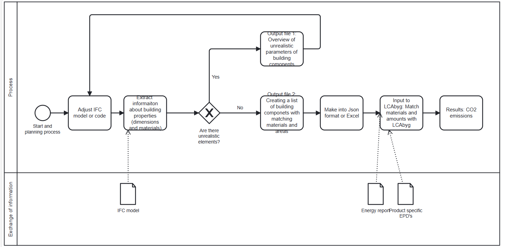
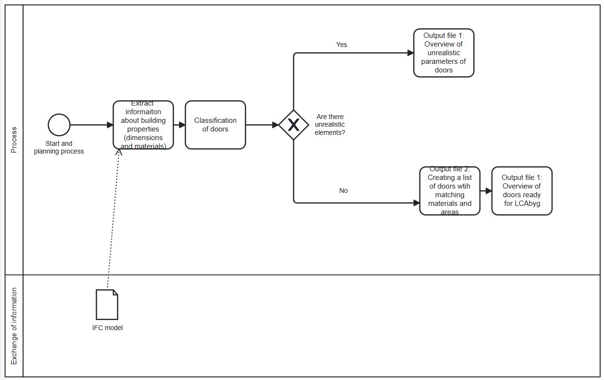

 

<h3 align="center">41934 Advanced Building Information Modeling (BIM)</h3>
  

    Assignment 03
    

    12th November 202
     

<!-- TABLE OF CONTENTS -->

  
Table of Contents

  <ol>
    <li>
      <a href="#Creators">Creators</a>
    <li>
      <a href="#getting-started">3A :Analyse use case</a>
    <li>
      <a href="#getting-started">3B: Propose a (design for a) tool / workflow</a>

      

  </ol>

# Table of Contents

1. [Creators](#creators)
2. [3A: Analyse use case](#3a-analyse-use-case)
3. [3B: Propose a (design for a) tool / workflow](#3b-propose-a-design-for-a-tool--workflow)

### THIS IS BASED ON THE MAIL FROM THE TEACHER
Some of you asked me to clearify what part of the BIM Execution plan, BEP you should focus on!?

Based on the BEP guide you should focus on the:

Model Uses, e.g. what is the tool/setup meant to do? Who will use it? In relation to what goals?
Process, e.g. what other roles and people are you relying on before, and after using the tool/setup? who will take the information from you? and use it for what? Is it an iterative process? is it defined linearly?
Information Exchange. e.g. What is the level of detailing (expected) for your tool/setup to work as intended? what is the LOD after running your tool/setup? Are you relying on classification systems? standards?
There are many other areas you can look into, but some are less relevant to your implementation, so rather than trying to write about everything, please try to focus on what your tool/setup really tries to achieve. 

<!-- CREATORS -->
## Creators
- Naja Johansen, s184525
- Zoyan Vangenechten, s232094
- Laura Iglesias Castro, s230383

<!-- 3A: Analyse use case -->
## 3A:Analyse use case
- Goal: Goal of the tool / workflow in one sentence. i.e. to support the user to calculate the total total cost of the project.

- Model Use (Bim Uses): Please refer initially to the Mapping BIM uses, use cases and processes section in this document.

  
The aim of our project is to create a workflow that extracts the necesary information of an IFC file in order to perform a life cycle analysis (LCA) of a buidling and at the same time analyze whether there are errors or unrealistic data in the model and clarify this for the user of this tool. An LCA calculation has become an essential tool in the construction industry, and in Denmark, it is mandatory to perform an LCA calculation for new buildings. However, there are several companies that perform LCAs anyway for internal use or for branding purposes. In Denmark, the most common LCA tool used for the building industry is LCAbyg. This use case is therefore intended for all companies that need to perform an LCA in the construction industry. To conduct a comprehensive LCA, one needs to have knowledge of the total building area, all materials used, and their respective quantities. Additionally, information about the building's energy consumption and product specific EDP’s are also required. 

The diagram below (Figure 1) illustrates the various steps associated with an IFC file and how to perform a life cycle assessment (LCA). This diagram were also presented in the previous assigment as the overall purpose remains the same.

The main purpose of this tool is to be used by an LCAbyg user in the industry to save time on current processes. In the existing practices, users typically have to manually extract extensive quantity schedules from the model or analyze building drawings manually. The user will utilize this tool as a kind of plug-in to analyze an IFC model automatically.

By using this tool, the following outputs are obtained:

- An overview of all building components with their dimensions, quantities, and materials. This will be organized in a way that can be easily used by the user to input the content into LCAbyg.
- An overview of building components that either lack a material or have unrealistic dimensions. This allows the user to quickly and easily identify which specific building components need to be re-modeled or further investigated. In addition, the tool will highlight any errors or unrealistic modeling choices made during the modeling phase. As a result, the tool's user will save time by receiving this summary sheet and will also know exactly where to update or account for errors in the model. Additionally, the user will also have the convenience of easily forwarding this overview to the person responsible for the model if the user is not directly involved in modeling activities.

<!-- 3B: Propose a (design for a) tool / workflow -->
## 3B: Propose a (design for a) tool / workflow
- Process: model the process diagram from your use case in BPMN.io please remember to save the .bpmn file and you can save a .svg file that you can insert into your report.

- description of the process of your tool / workflow.

As a scope of our project, the group has been solely on gathering data related to the "doors" category (materials and quantities) using the IFC model of the Skylab building at DTU campus. Diagram 2 below illustrates the proof of concept that was performed in this use case. The diagram only describes the workflow we followed to gather dimensions and material data for the doors category. 

The group's script generates two Excel sheets as output. The first Excel sheet, “Output_file_1_Errors,” is a direct output that summarizes all the doors in the building with divergent values. This can be caused by the IFC-file, and this first output makes it easy to identify potential issues for future LCA (Life Cycle Assessment) calculations. There are two possible ways in which a door can receive an error. This is based on "rules" made by the group: either the area of the door is lower than 1.8m², or the file does not provide any material information for the door. The output also indicates which of these errors has been assigned to a specific door.
In the "Output_file_1_Errors," you can clearly see where there may be problems for future LCA calculations. This detailed breakdown ensures that you can address issues promptly, ensuring the accuracy of your assessments.
The second output Excel file contains the necessary data required for LCA calculations in the software “LCAbyg.” This file not only provides essential data but also offers a summarized list of all the doors, neatly categorized by similar size and materials. Each door or door type is associated with its corresponding area, width, height, material, and, in the case of door types, the number of repetitions in the IFC-file.
This Excel file streamlines the process of performing LCA calculations, making it user-friendly and efficient. It not only assists in individual assessments but also offers a comprehensive overview/summary of the building's components, which can be invaluable during project meetings and decision-making processes. Its organized format enhances collaboration and ensures that all stakeholders have the information they need at their fingertips.
These outputs are essential tools for architects, engineers, and sustainability professionals to make informed decisions about building design and materials, ultimately contributing to a more sustainable and environmentally-conscious construction process.

If you wish to further develop and enhance this tool in the future, it's important to consider how to identify the specific bilding part of the building. Currently, a specific ID number is missing, which needs to be linked to the particular building component represented in the two output files. For example if one intends to use output file 1 (represents errors) to go back into the building model and actually edit or update it, it's necessary to know the specific location, which is not currently possible.

In this use case, only properties associated with the doors have been examined. In the future, the tool will be developed further to include all building components.

<!-- 3D: Value What is the potential improvement offered by this tool? -->
## 3D: Value What is the potential improvement offered by this tool?

This is the common question when developing tools and processes as an intrapreneur in a company. You should consider the business and societal value of this tool – does it save time to the company, does it make employees happier / more productive? Could it reduce material use in society?

Describe the business value (How does it create value for your business/employer)
Describe the societal value (How does it make the world better)
N.B. If it doesn’t do either of these things (ideally it should do both - don’t do it!!)

