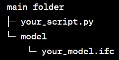

## Introduction
The tool is intended for LCA consultants with little knowledge on BIM modelling and programming. Therefore, this tutorial aims to target role level 1 (modeller). Also, we advise to check the the "video tutorial" (hyperlink) as a complementary material. 

Our tool extracts the necesary information of an IFC file in order to perform a life cycle analysis (LCA) of a buidling: materials and quantities. Besides, it identifies potential modelling errors (such as unrealistic dimensions or lack of material assignations) that could affect the outcomes of the LCA. This tool is a proof of concept and focus only on extracting information related to the doors of the building. A more detailed description of the tool can be found in [README file](https://github.com/NajaJohansen/41934-Advanced-Building-Information-Modeling-BIM-/blob/main/README.md)

This tutorial will go through two sections:
- How to get started
- Run code and understand output files

## How to get started
This section will go into detail on how to prepare yourself to use the tool. You can also refer to the [video](https://youtu.be/LjVTEKssetE) for additional guidance.

- The first step in to using the code is to download a coding program for pyhton laguage. This program/tool has been made with Spyder, a program which was launched by a navigator called Ananconda. To download Anaconda click [here](https://www.anaconda.com/download). Once the program hs been downloaded you can open it. After a short start up you will direclty be navigated to the home page. There you will see a button to launch Spyder, after a few moments you will find yourself in the python coding program. 
  
- The code requires a precise directory that includes the script and IFC-file. It should look like this:

- To run the code some packages must be installed in Anaconda because these are not already present. To do this you need to copy and paste the following code lines into the Spider console, press enter amd wait until the screens says that the download has been completed.
  - pip install ifcopenshell
  - pip install xlswriter
  - pip install path

## Run code
This section will go through the output files and how to understand them. You can also watch to the [video](https://youtu.be/VbBmxDzZhDM) for additional guidance.

The group's script generates two Excel sheets as output:
- “Output_file_1_Errors”
- “Output_file_2_LCAbyg"

The first Excel sheet, “Output_file_1_Errors,” is a direct output that summarizes all the doors in the building with divergent values. These values can be caused by the mistakes in the IFC-file, and this output makes it easy to identify potential issues for future LCA (Life Cycle Assessment) calculations. There are two possible ways in which a door can receive an error. This is based on "rules" made by the group: either the area of the door is lower than 1.8m² (so an unrealistic door size), or the file does not provide any material information for the door. The output also indicates which of these errors has been assigned to a specific door. In the "Output_file_1_Errors," you can clearly see where there may be problems for future LCA calculations. 
This detailed breakdown ensures that you can address issues promptly, ensuring the accuracy of your assessments. What you can do now is to send this specific overview back to the person responsible for the modeling process of the IFC file. In this way, communication becomes clear and effective between the modeling responsible and the LCA responsible.

The second output Excel file contains the necessary data required for LCA calculations in the software “LCAbyg.” This file not only provides essential data but also offers a summarized list of all the doors, neatly categorized by similar size and materials. Each door or door type is associated with its corresponding area, width, height, material, and, in the case of door types, the number of repetitions in the IFC-file.
This Excel file streamlines the process of performing LCA calculations, making it user-friendly and efficient. It not only assists in individual assessments but also offers a comprehensive overview/summary of the building's components. 
